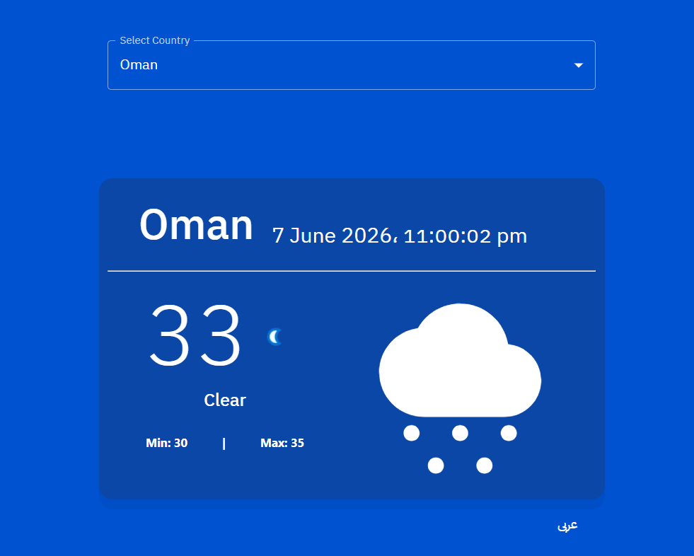
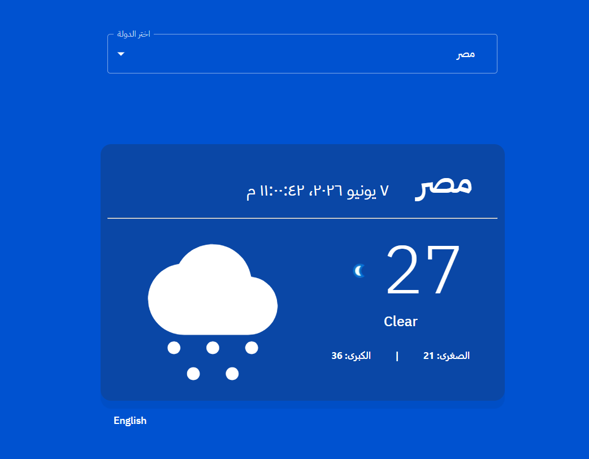

# 🌤️ Weather Dashboard

<!-- Line breaks to add clean spacing above the badges -->
<br>

<p align="left">
  <a href="https://react.dev">
    <code>React</code>
  </a>
  &nbsp;&nbsp;🔹&nbsp;&nbsp;
  <a href="https://js.org">
    <code>Redux Toolkit</code>
  </a>
  &nbsp;&nbsp;🔹&nbsp;&nbsp;
  <a href="https://mui.com">
    <code>Material UI</code>
  </a>
  &nbsp;&nbsp;🔹&nbsp;&nbsp;
  <a href="https://vercel.com">
    <code>Vercel</code>
  </a>
</p>

<!-- Line breaks to add clean spacing below the badges -->


A professional, responsive Weather Dashboard web application built with **React** and **Redux Toolkit**, styled using **Material-UI (MUI v5)**. The application handles global state management for asynchronous data fetching, localized date-time telemetry, and instant dual-language switching with responsive Right-to-Left (RTL) layout support.

⚡ **[اضغط هنا لمعاينة المشروع مباشرة على Vercel / Live Demo](https://weather-hq3pohhz7-ahmed-hegazy-h-projects.vercel.app/)**

---
<div align="center" style="margin: 25px 0; max-width: 800px; margin-left: auto; margin-right: auto;">

  <!-- Image 1 (Open by default) -->
  <details open style="margin-bottom: 15px; background: rgba(0, 105, 92, 0.05); padding: 12px; border-radius: 12px; border: 1px solid rgba(0, 105, 92, 0.15); text-align: left; direction: ltr;">
    <summary style="font-weight: bold; font-size: 16px; color: #00695c; cursor: pointer; user-select: none;">📸 Main Dashboard View (Click to Collapse)</summary>
    <div align="center">
      
    </div>
  </details>

  <!-- Image 2 -->
  <details style="margin-bottom: 15px; background: rgba(0, 105, 92, 0.05); padding: 12px; border-radius: 12px; border: 1px solid rgba(0, 105, 92, 0.15); text-align: left; direction: ltr;">
    <summary style="font-weight: bold; font-size: 16px; color: #00695c; cursor: pointer; user-select: none;">📸 Arabic Localization View (Click to Open)</summary>
    <div align="center">
      
    </div>
  </details>


</div>


## ✨ Features

* **Global State Architecture**: Driven entirely by Redux Toolkit slices (`createAsyncThunk`) to separate API business logic from UI components.
* **Material-UI Dropdown Selector**: A fully integrated, custom-styled MUI `Select` component featuring **11 countries** with synchronized localization.
* **Native API Language Translation**: Sends dynamic language payloads directly to the weather endpoint to retrieve localized, server-side weather condition descriptions instantly.
* **Frosted Glassmorphism UI Theme**: Translucent dark card aesthetics utilizing high-end backdrop blur filters (`backdrop-filter: blur(10px)`) for a premium visual depth.
* **Full Dual-Language Localization**: Instant structural layout switching (LTR / RTL) between English and Arabic using `react-i18next` and localized `moment.js` date-time formatting.
* **Memory Leak Mitigation**: Utilizes native `AbortSignal` parameters inside Axios requests to automatically cancel pending network queries if a component unmounts or state transitions rapidly.

---

## 🏗️ Project Architecture & Folder Tree

The layout keeps your UI views completely separated from state management and localization configurations:

```text
src/
├── locales/                # Local translation dictionaries
│   ├── ar.json             # Arabic key-value language strings
│   └── en.json             # English key-value language strings
├── App.js                  # Core Dashboard layout view & action selectors
├── App.css                 # Background gradient maps & utility styles
├── i18n.js                 # Localized translation plugin configurations
├── index.js                # React root element mounting & Redux Store Provider wrapper
├── store.js                # Central Redux state storage configurations
└── weatherApiSlice.js      # Redux Toolkit slice, reducers, and async API fetch thunk
```

---

## 🛠️ Tech Stack & Key Libraries

* **Core UI Engine**: React.js (v18+)
* **State Management**: Redux Toolkit & React-Redux
* **Design System**: Material-UI (MUI v5)
* **Asynchronous Client**: Axios
* **Time & Date Engineering**: Moment.js
* **Internationalization Layer**: i18next & react-i18next

---

## 🚀 Getting Started

Follow these steps to run and test the project locally on your development machine:

### 1. Clone the Repository
```bash
git clone https://github.com.git
cd YOUR_WEATHER_REPO_NAME
```

### 2. Install Dependencies
```bash
npm install
```

### 3. Launch Local Development Server
```bash
npm start
```
*Open [http://localhost:3000](http://localhost:3000) inside your web browser to view the running interface dashboard.*

---

## 🎨 Layout Styling & Presentation

* **Typography Systems**: Custom-mapped `IBM Plex Sans` type scale configurations initialized globally within the MUI theme provider.
* **Interactive Element Styling**: Custom CSS style overrides inject cohesive alpha transparencies and glowing border indicators into Material-UI drop-down components.
* **Conditional UI States**: Built-in state engine blocks gracefully toggle visibility masks between loading spinners (`CircularProgress`), active connection error models, or the final telemetry data cards.

---

## 📄 License

This project is open-source and available under the **MIT License**. Feel free to copy, modify, and build upon it!
